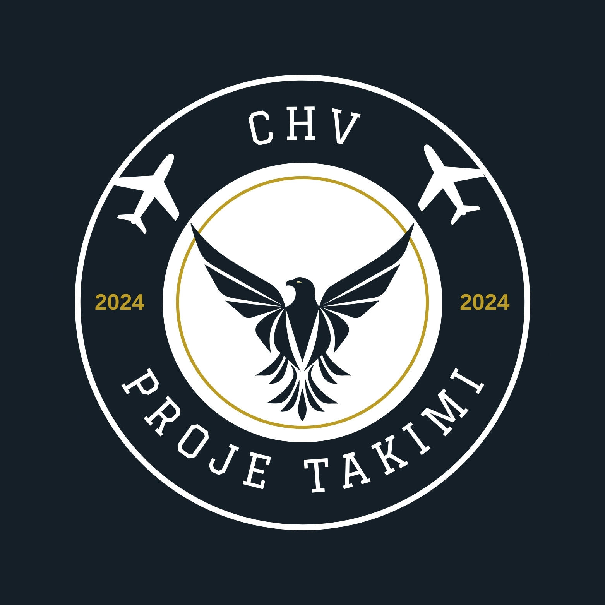
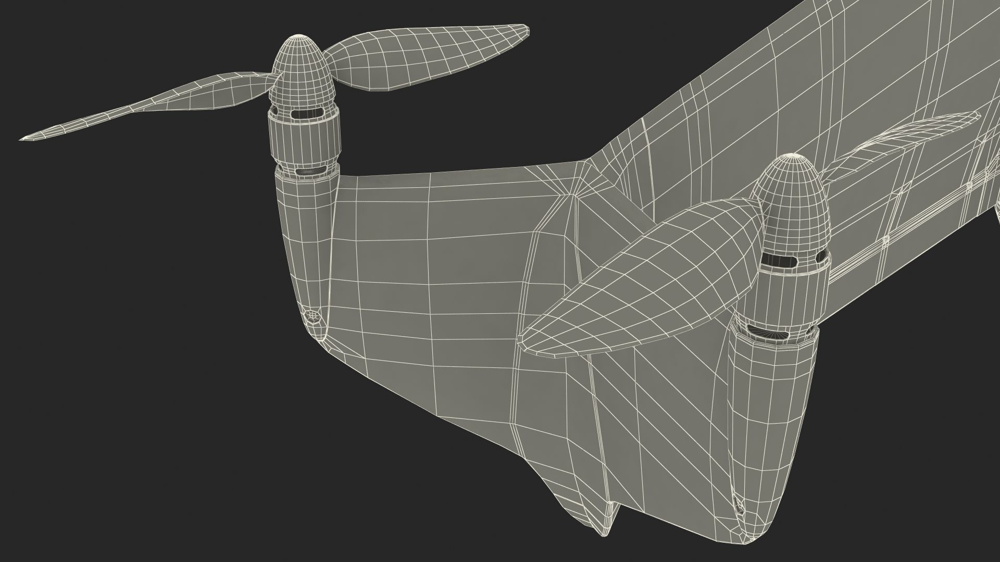
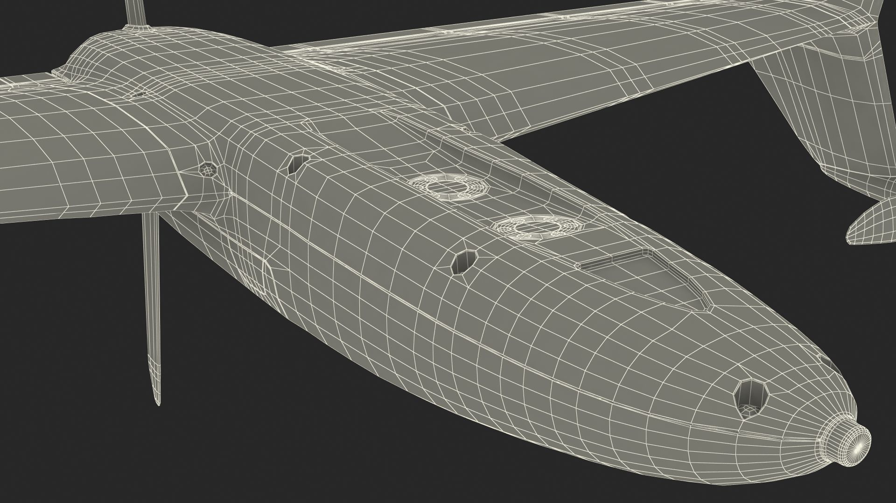
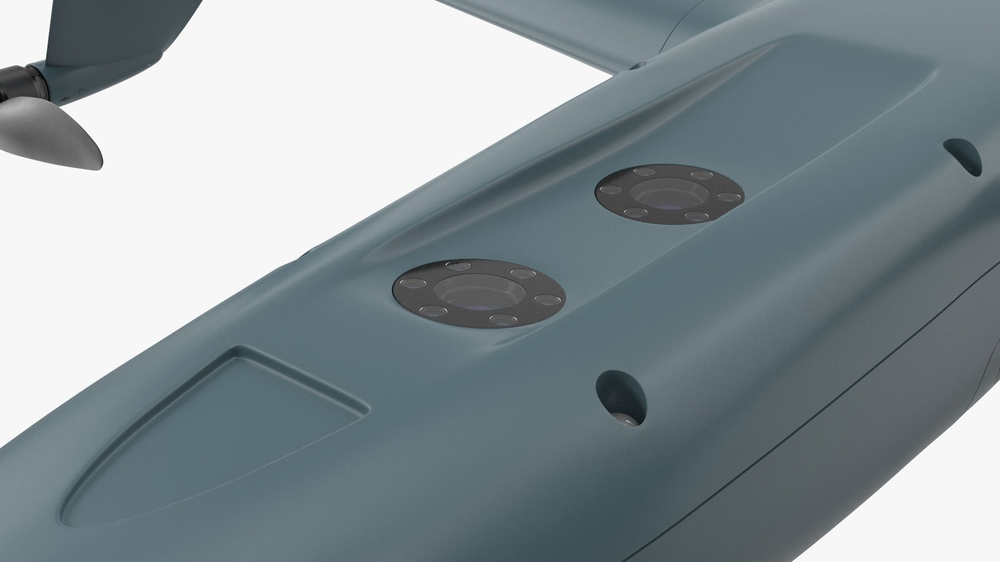
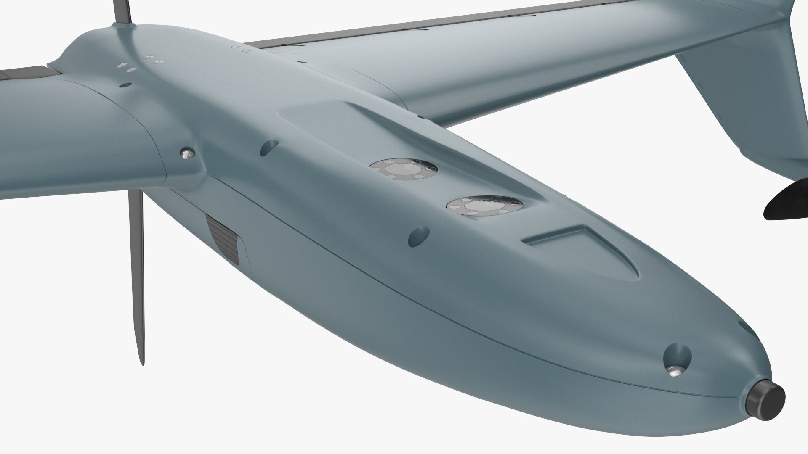

<!DOCTYPE html>
<html lang="en">
<head>
  <meta charset="UTF-8">
  <meta name="viewport" content="width=device-width, initial-scale=1.0">
  <title>AeroGUARD VTOL</title>
  
</head>
<body>
  <header>
    
    <h1>AeroGUARD VTOL</h1>
  </header>
  
  <main>
    <section>
      <h2>About AeroGUARD VTOL</h2>
      
AeroGUARD, a high-performance VTOL (Vertical Take-Off and Landing) aircraft, offers a unique and versatile solution for various applications. With its advanced systems and capabilities, AeroGUARD provides an efficient and reliable platform for a wide range of missions.

    </section>
    
    <section>
      <h2>Key Specifications</h2>
      <table>
        <tr>
          <th>Parameter</th>
          <th>Value</th>
        </tr>
        <tr>
          <td>Maximum Speed</td>
          <td>180 km/h</td>
        </tr>
        <tr>
          <td>Range</td>
          <td>5000 m</td>
        </tr>
        <tr>
          <td>Payload</td>
          <td>4 sqat</td>
        </tr>
        <tr>
          <td>Maximum Takeoff Weight</td>
          <td>25 kg</td>
        </tr>
      </table>
    </section>
    
    <section>
      <h2>Key Features</h2>
      <ul>
        <li><strong>VTOL Capability:</strong> Dikey kalkış ve iniş özelliği, minimum alan gereksinimiyle operasyon yapma imkanı sağlar.</li>
        <li><strong>Hassas Navigasyon:</strong> Gelişmiş GPS ve INS sistemleriyle hassas konum belirleme ve izleme sağlar.</li>
        <li><strong>Modüler Tasarım:</strong> Farklı görevler için değiştirilebilir ve özelleştirilebilir bir platforma sahiptir.</li>
      </ul>
    </section>
    
    <section>
      <h2>Technical Details</h2>
      

        
        
        
        
      

    </section>
  </main>
  
  <footer>
    
&copy; 2024 AeroGUARD. All rights reserved.

    <a href="#" class="btn">Technical Details</a>
    <a href="#" class="btn">Request a Quote</a>
  </footer>
</body>
</html>
